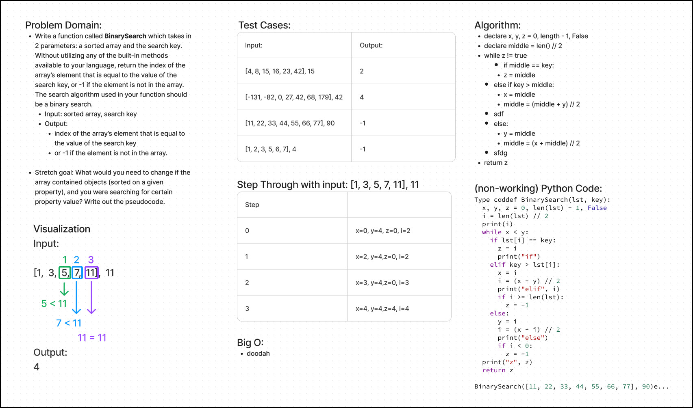

# Code Challenge: Class 03

## Feature Task(s)

Write a function called `BinarySearch` which takes in 2 parameters: a sorted array and the search key. Without utilizing any of the built-in methods available to your language, return the index of the array’s element that is equal to the value of the search key, or -1 if the element is not in the array. The search algorithm used in your function should be a binary search.

## Stretch Goal

What would you need to change if the array contained objects (sorted on a given property), and you were searching for certain property value? Write out the pseudocode. **not attempted**

## Whiteboard Process

## Approach & Efficiency

The instructions required the use of a binary search algorithm. [The number of steps in the binary search algorithm is directly related to the logarithmic of its number of elements.](https://medium.com/@samip.sharma963/binary-search-and-its-big-o-3333d13bd6ec)

## Solution

Collaboration: Solution taken from ['The Self-Taught Computer Scientist' by Cory Althoff](https://www.theselftaughtprogrammer.io/)
