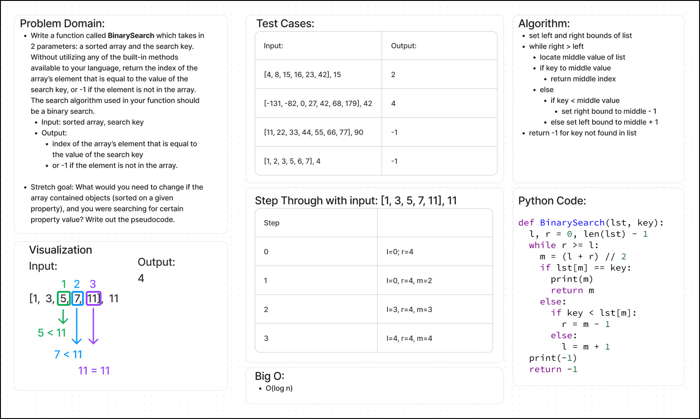

# Code Challenge: Class 03

## Feature Task(s)

Write a function called `BinarySearch` which takes in 2 parameters: a sorted array and the search key. Without utilizing any of the built-in methods available to your language, return the index of the array’s element that is equal to the value of the search key, or -1 if the element is not in the array. The search algorithm used in your function should be a binary search.

## Stretch Goal

What would you need to change if the array contained objects (sorted on a given property), and you were searching for certain property value? Write out the pseudocode.

## Whiteboard Process

## Approach & Efficiency

<!-- What approach did you take? Why? What is the Big O space/time for this approach? -->

## Solution

<!-- Show how to run your code, and examples of it in action -->
