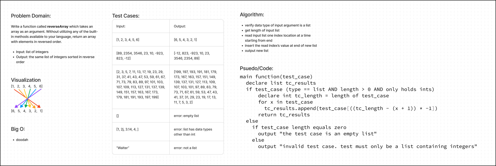

# Code Challenge: Class 01

# Challenge Title
Write a function called `reverseArray` which takes an array as an argument. Without utilizing any of the built-in
methods available to your language, return an array with elements in reversed order.

## Whiteboard Process

## Approach & Efficiency
The solution uses if statements to validate the test_case meets expectations, and then executes a for loop to
iterate through the test_case from back-to-front to insert the values into tc_results

## Solution
n/a
