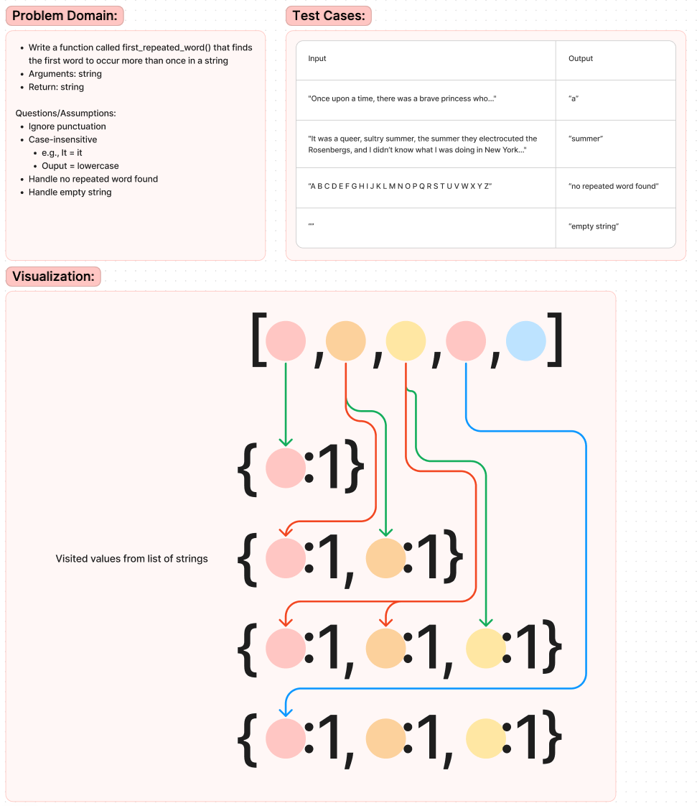

# Code Challenge 31 - Hashable Repeated Word

Write a function called first_repeated_word() that finds the first word to occur more than once in a string

## Whiteboard Process

## Approach & Efficiency

<!-- What approach did you take? Why? What is the Big O space/time for this approach? -->

## Solution

<!-- Show how to run your code, and examples of it in action -->
