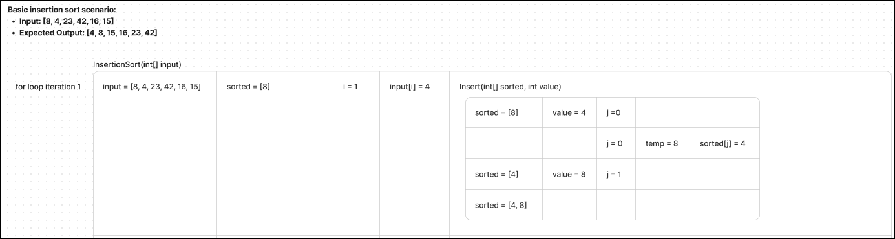
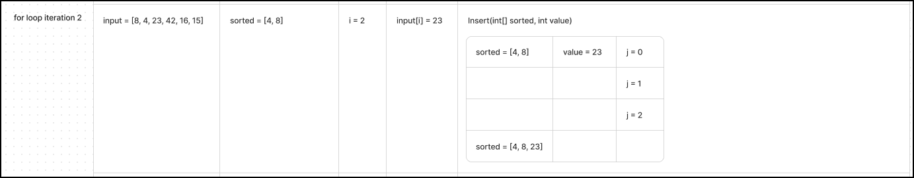
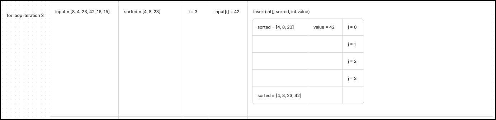
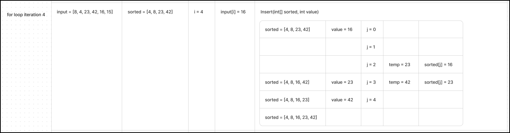
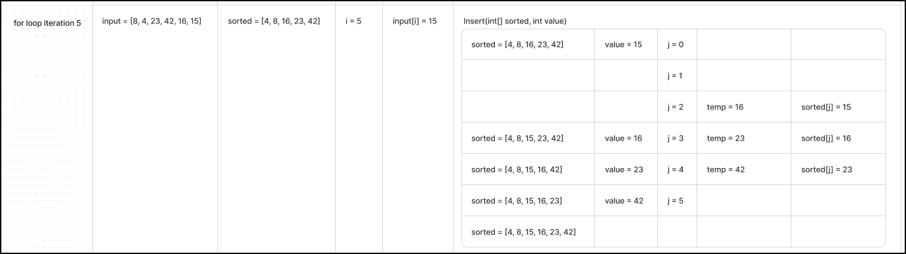
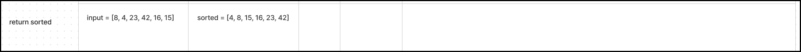

# Blog Notes: Insertion Sort

- Code Challenge: Class 26 - Insertion Sort
- Author: Manuch Sadri

## Review

- [Refresh Your Understanding of Big O](https://www.youtube.com/watch?v=waPQP2TDOGE)

## Assignment

Review the pseudocode below, then trace the algorithm by stepping through the process with the provided sample array. Document your explanation by creating a blog article that shows the step-by-step output after each iteration through some sort of visual.

### Implementation

- Provide a visual step through for each of the sample arrays based on the provided pseudo code
- Convert the pseudo-code into working code in your language
- Present a complete set of working tests

## Insertion Sort

Insertion sort is a simple sorting algorithm that builds the final sorted array (or list) one item at a time by comparisons. [Wikipedia](https://en.wikipedia.org/wiki/Insertion_sort)

## Pseudocode

```pseudo
Insert(int[] sorted, int value)
  initialize j to 0
  WHILE value > sorted[j]
    set j to j + 1
  WHILE j < sorted.length
    set temp to sorted[j]
    set sorted[j] to value
    set value to temp
    set j to j + 1
  append value to sorted

InsertionSort(int[] input)
  LET sorted = New Empty Array
  sorted[0] = input[0]
  FOR i from 1 up to input.length
    Insert(sorted, input[i])
  return sorted
```

## Sample Arrays

- [ ] Basic: `[8,4,23,42,16,15]`
- [ ] Reverse-sorted: `[20,18,12,8,5,-2]`
- [ ] Few uniques: `[5,12,7,5,5,7]`
- [ ] Nearly-sorted: `[2,3,5,7,13,11]`

## Trace

### Basic insertion sort

- Sample array: `[8,4,23,42,16,15]`

- Pass 1:


- Pass 2:


- Pass 3:


- Pass 4:


- Pass 5:


- Return:

