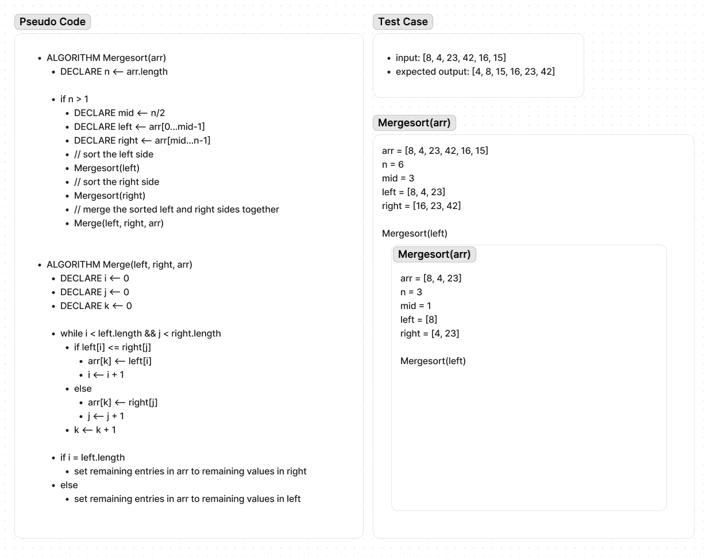

# Blog Notes: Merge Sort

- Code Challenge: Class 27 - Merge Sort
- Author: Manuch Sadri

## Assignment

Review the pseudocode below, then trace the algorithm by stepping through the process with the provided sample array. Document your explanation by creating a blog article that shows the step-by-step output after each iteration through some sort of visual.

Once you are done with your article, code a working, tested implementation of Merge Sort based on the pseudocode provided.

### Implementation

- Provide a visual step through for each of the sample arrays based on the provided pseudo code
- Convert the pseudo-code into working code in your language
- Present a complete set of working tests

## Merge Sort

> In computer science, merge sort (also commonly spelled as mergesort) is an efficient, general-purpose, and comparison-based sorting algorithm. Most implementations produce a stable sort, which means that the order of equal elements is the same in the input and output. Merge sort is a divide-and-conquer algorithm that was invented by John von Neumann in 1945. [Wikipedia](https://en.wikipedia.org/wiki/Merge_sort)

## Pseudocode

```pseudo
ALGORITHM Mergesort(arr)
    DECLARE n <-- arr.length

    if n > 1
      DECLARE mid <-- n/2
      DECLARE left <-- arr[0...mid]
      DECLARE right <-- arr[mid...n]
      // sort the left side
      Mergesort(left)
      // sort the right side
      Mergesort(right)
      // merge the sorted left and right sides together
      Merge(left, right, arr)

ALGORITHM Merge(left, right, arr)
    DECLARE i <-- 0
    DECLARE j <-- 0
    DECLARE k <-- 0

    while i < left.length && j < right.length
        if left[i] <= right[j]
            arr[k] <-- left[i]
            i <-- i + 1
        else
            arr[k] <-- right[j]
            j <-- j + 1

        k <-- k + 1

    if i = left.length
       set remaining entries in arr to remaining values in right
    else
       set remaining entries in arr to remaining values in left
```

## Sample Arrays

- Basic imput: `[8,4,23,42,16,15]`
- Reverse-sorted: `[20,18,12,8,5,-2]`
- Few uniques: `[5,12,7,5,5,7]`
- Nearly-sorted: `[2,3,5,7,13,11]`

## Trace

### Merge sort with basic sample array input

- Partial draft:

